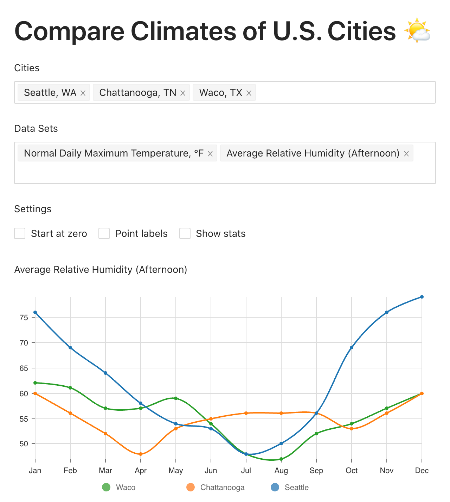

import Layout from 'layouts/Layout';

export default ({children}) => (
  <Layout title="Projects">{children}</Layout>
);

## GitHub

Check out [my GitHub profile](https://github.com/ianobermiller) to see what I've been up to.

## Recent

### Climate Compare

- Compare climates of U.S. cities
- Data from the
  [NOAA](https://www.ncdc.noaa.gov/ghcn/comparative-climatic-data)
- Charts by [Nivo](https://nivo.rocks/)
- [Source on GitHub](https://github.com/ianobermiller/climate-compare)

## Other Side Projects

### Legends of Descent

- Dungeon crawler style RPG for Windows Phone
- Unlimited procedurally generated dungeon maps, items, and enemy groups
- Slay monsters, reap loot, and equip yourself with the very best weapons and armor
- My favorite pieces: dungeon map generation, particle effects
- Written in C# using the XNA framework

### NuclearMail

NuclearMail is an experiment of writing a webmail client using React and the Flux architecture. It runs completely in the browser and uses the Gmail REST API.

- Code at: https://github.com/ianobermiller/nuclearmail/
- Demo at: http://ianobermiller.github.io/nuclearmail/

## University

### Bingo Card Maker

- Create and print bingo cards online
- Hosted on AppHarbor
- Written in C# on top of MVC4

### AuctionDB

- a simple auction website written in Python cgi, in collaboration with [Fran Hurtado][6]

## High School

### Take the Cake

- Built using HTML, PHP, and Javascript
- Features an easily expandable photo gallery with dynamically generated thumbnails
- Challenge: Fitting in a lot of information about cakes without overwheming visitors

### Spiegelhoff & Associates Insurance

- Built using HTML, PHP, and Javascript
- Features an online quote and claim request system
- Challenge: Designing the forms to be standards compliant and user-friendly while asking for lots of information

### Geneva Lake Museum

- Built using HTML and Javascript (Ajax)
- Features and interactive tour of the museum with dynamically loading pictures of the exhibits
- Challenge: Capturing the historic feel of the museum while keeping the website looking fresh and updated
